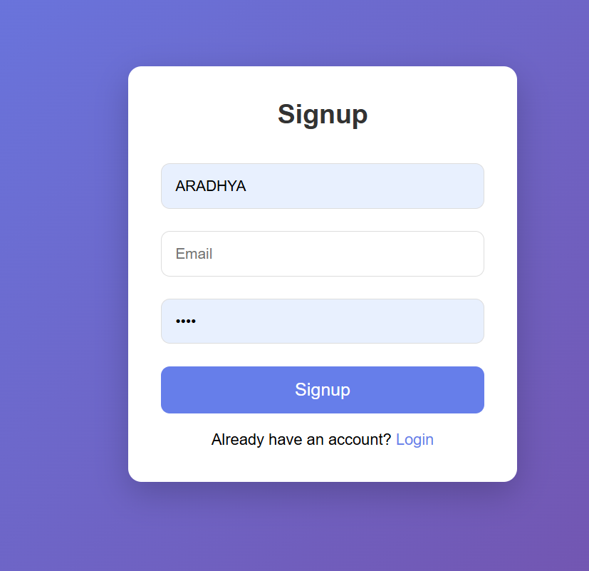
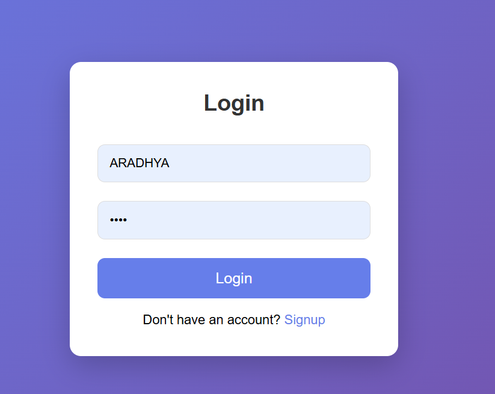
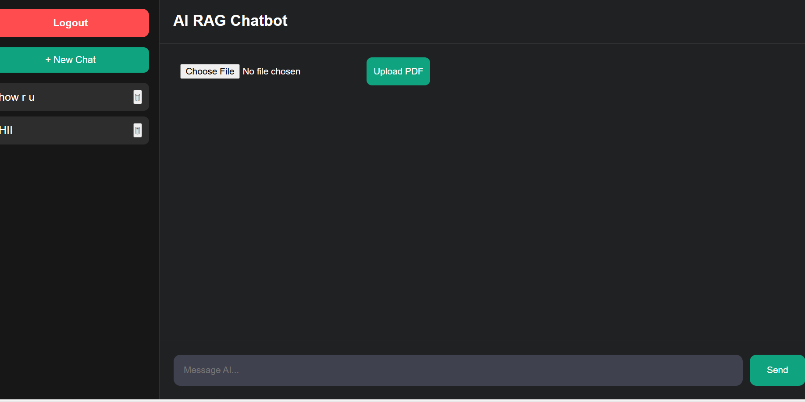
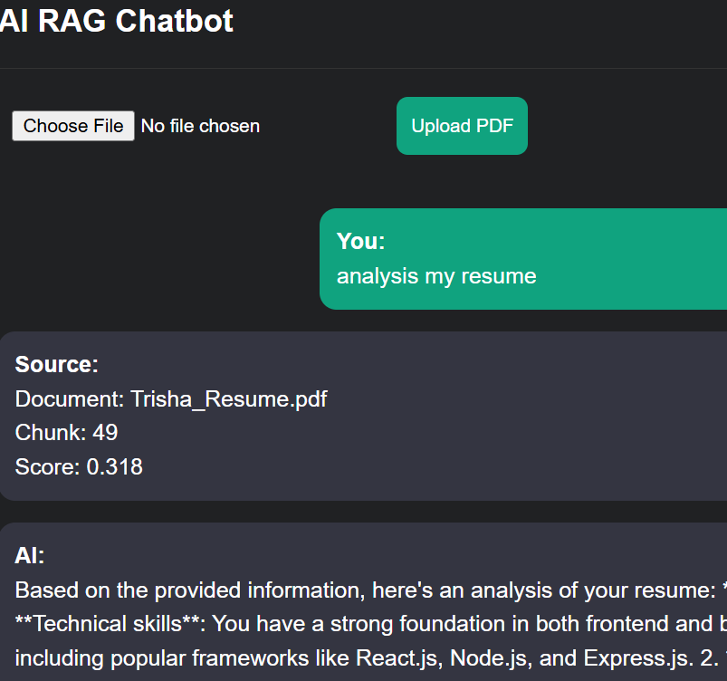

# AI-Powered Document Analysis Chatbot (RAG)

## Overview
This project is an AI-powered chatbot built using Django and Retrieval-Augmented Generation (RAG).  
Users can upload PDF documents such as resumes, reports, and research papers, and ask questions based on document content.

The chatbot retrieves relevant document chunks using embeddings and cosine similarity, then uses an LLM to generate contextual responses.

---

## Features

- User Signup / Login Authentication
- Secure Logout Functionality
- PDF Upload & Parsing
- Text Chunking for Large Documents
- Semantic Search using Embeddings
- Cosine Similarity-Based Retrieval
- Resume Analysis
- Document Summarization
- Chat History with Sidebar Sessions
- User-Specific Chat Isolation
- PostgreSQL Database Integration

---

## Tech Stack

### Backend
- Python
- Django
- Django REST Framework

### Database
- PostgreSQL

### Frontend
- HTML
- CSS
- JavaScript

### AI / NLP
- RAG Pipeline
- Embeddings
- Cosine Similarity
- LLM API Integration

---

## Architecture

PDF Upload  
↓  
Text Extraction  
↓  
Chunking  
↓  
Embeddings Generation  
↓  
Vector Similarity Search  
↓  
LLM Response Generation

---

## Screenshots

### Signup Page


### Login Page


### Chat Interface


### Resume Analysis


---

## Installation

Clone repository:

```bash
git clone <your_repo_url>
```

Install dependencies:

```bash
pip install -r requirements.txt
```


Run migrations:

```bash
python manage.py makemigrations
python manage.py migrate
```

Run server:

```bash
python manage.py runserver
```

---

#

## Author
Ritika Sharma